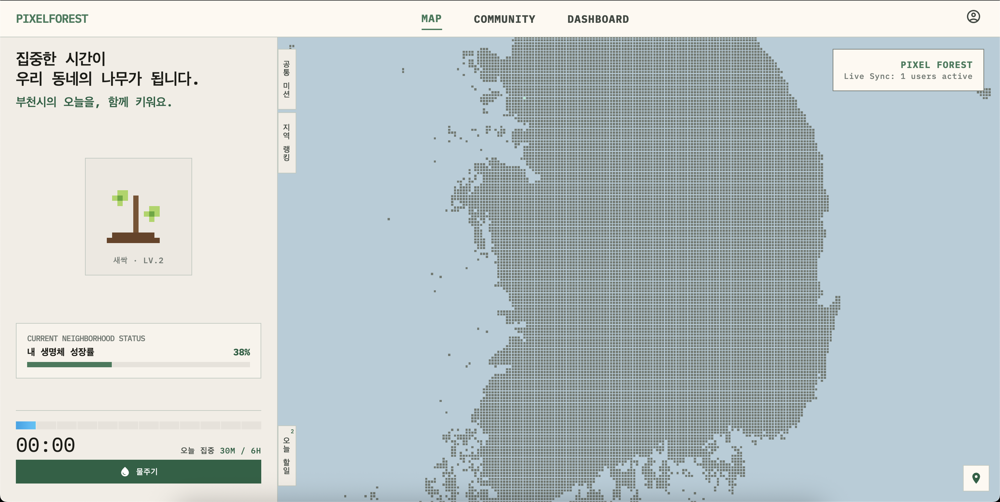
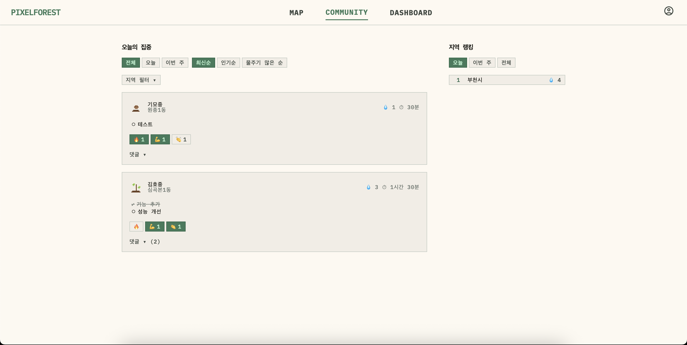
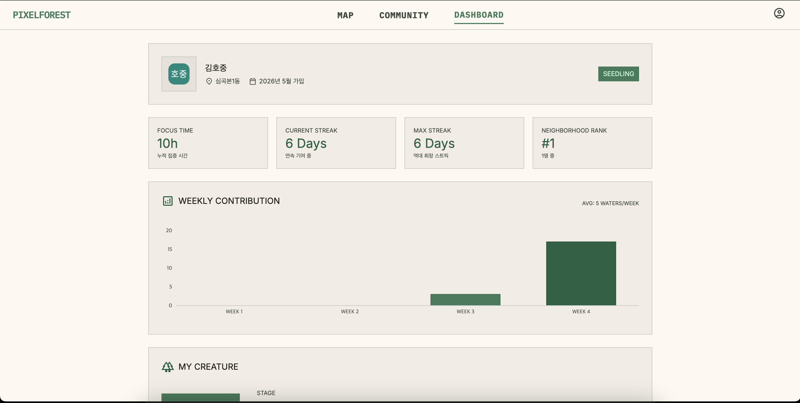

<div align="center">

# 🌲 MakeForest

**같은 동네 사람들과 함께 집중하고, 우리 동네 숲을 키워보세요.**

[](https://www.pixel-forest.co.kr/)

<a href="https://www.pixel-forest.co.kr/">
  
</a>

</div>

---

## 소개

MakeForest는 **포모도로 기법 기반 지역 집중 서비스**입니다.  
30분 집중하면 우리 동네에 물을 주고, 내 생명체가 자라고, 전국 지도 위에서 이웃들과 함께 숲을 만들어갑니다.  
취업 준비, 시험 공부, 재택근무 — 혼자지만 혼자가 아닌 집중을 경험하세요.

---

## 주요 기능

### ⏱ 포모도로 타이머

- **30분 사이클** 기반 집중 타이머. 1사이클 완료 시 1칸 적립
- **12칸 세그먼트 게이지** — 하루 최대 6시간(12사이클) 누적
- 일시정지 / 재개 지원. 모든 시간 계산은 **서버 권위적**으로 처리
- 매일 자정(KST 00:00) 자동 초기화

### 💧 물주기 & 생명체 진화

- 사이클 달성마다 물주기 1회 활성화 (하루 최대 12회)
- 물을 줄수록 내 생명체가 **0단계(씨앗) → 9단계(세계수)**까지 진화

### 🗺 전국 지도 — 픽셀 모드 & 포레스트 모드

- **픽셀 모드**: 전국 행정동을 1픽셀로 표현. 활성 동네일수록 밝은 초록색으로 표시
- **포레스트 모드**: 특정 지역 클릭 시 읍·면·동 단위 확대. 이웃들의 생명체가 지도 위에 살아 숨 쉬는 애니메이션으로 표시
- 휠·핀치 줌, 드래그 이동 지원
- 호버 시 지역명 · 활성 인원 · 총 물주기 툴팁

### 🎯 지역 공동 미션 (Daily Collection)

- 지역 주민들이 함께 달성하는 **일일 집중 목표**
- 목표 인원: `max(4, 최근 7일 활성 유저 수 × 3)` 동적 산정
- 세션 시작 시 자동 참여 카운트 증가
- 목표 달성 시 동네 지도(포레스트 모드)에 특별 생명체가 오버레이로 등장 — 유저 오버레이와 동일한 방식으로 지도 위에 표시

### 💬 커뮤니티 피드

- 세션 시작 시 자동으로 오늘의 집중 포스트 생성
- **반응**: 🔥 · 💪 · 👏 이모지 리액션 (이모지별 1회)
- **댓글**: 자유 텍스트 입력
- 기간 필터(오늘 / 이번 주 / 전체) · 정렬(최신 / 인기 / 물주기 순) 지원

### 🏆 랭킹

- **동(洞) 랭킹**: 우리 동네 내 물주기 순위
- **지역 랭킹**: 시·군·구 단위 물주기 합산 순위
- **이웃 순위**: 같은 동 내 나의 등수 실시간 확인
- 기간 선택: 오늘 / 이번 주 / 전체

### 📡 실시간 SSE

- 이웃이 물을 주면 **중앙 상단 토스트**로 즉시 알림 ("OOO님이 물을 줬어요!")
- 히트맵 밝기 · 생명체 오버레이 · XP 게이지 **실시간 동기화**
- 포레스트 모드에서 이웃 생명체의 상태(집중중 / 일시정지 / 자리비움) 실시간 반영

### 📊 대시보드 (마이페이지)

- 총 누적 집중 시간
- 연속 기여 일수 (스트릭) · 최대 스트릭
- 주간 물주기 현황 (최근 4주 그래프)
- 동네 내 기여 순위 · 내가 키운 생명체

---

## 스크린샷

| 메인 (지도 & 패널) | 커뮤니티 | 마이페이지 |
|:---:|:---:|:---:|
|  |  |  |

---

## 기술 스택

| 분류               | 스택                                                                   |
| ------------------ | ---------------------------------------------------------------------- |
| **Frontend**       | Next.js 15 (App Router), TypeScript, Zustand, Canvas API, TailwindCSS |
| **Backend**        | Node.js, Express, TypeScript                                           |
| **Database**       | PostgreSQL, Prisma ORM                                                 |
| **Cache / 실시간** | Redis (Upstash), Server-Sent Events (SSE)                              |
| **인증**           | NextAuth.js — Kakao · Google OAuth                                     |
| **배포**           | Vercel (web), Railway (server), Supabase (DB)                          |
| **모노레포**       | Turborepo, yarn workspaces                                             |

---

## 프로젝트 구조

```
MakeForest/
├── apps/
│   ├── web/          # Next.js 프론트엔드
│   └── server/       # Express 백엔드 API
├── packages/
│   ├── db/           # Prisma 스키마 & 클라이언트
│   ├── redis/        # Redis 클라이언트 & 유틸리티
│   └── types/        # 공유 타입 정의
└── turbo.json
```

---

<div align="center">

🌐 **[pixel-forest.co.kr](https://www.pixel-forest.co.kr/)**

</div>
